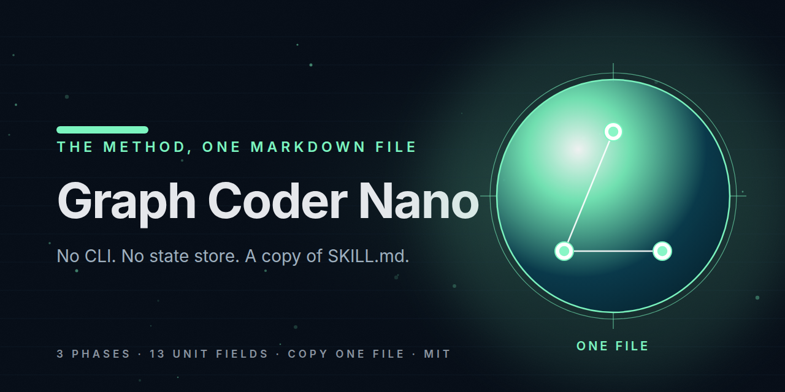

<p align="center">
  
</p>

# Graph Coder Nano

Part of the [Graph Coder](https://github.com/lucadominguez/graph-coder) family:
the whole method in one markdown file. No CLI, no package, no state store,
nothing to install but a copy. `SKILL.md` is the whole product.

## Install

Copy `SKILL.md` into wherever your harness reads skills from.

```sh
cp SKILL.md ~/.claude/skills/graph-coder-nano/SKILL.md
```

```powershell
Copy-Item SKILL.md "$env:USERPROFILE\.jcode\skills\graph-coder-nano\SKILL.md"
```

Then start a run and point the session at it. It also works as a plain prompt:
paste it in, and it reads the same.

## Which one to use

| | Graph Coder | Lite | Nano |
| --- | --- | --- | --- |
| Phases | 10 | 4 | 3 |
| Skill files | 8 | 3 | 1 |
| Unit fields | ~35 | 19 | 13 |
| Tooling | Python CLI, SQLite ledger, compiled graph | `gcl` CLI, JSON state | none |
| Checks a bad plan | mechanically | mechanically | you do |
| Install | pip + skills | pip + skills | copy one file |

Nano when you want the method and your own judgment enforcing it: a run you are
watching, a repo without Python, a harness that is not yours. **Lite** when you
want `gcl check` to refuse a plan whose scopes collide or whose units are missing
contract fields, and `gcl review` to make a completion without evidence
impossible rather than merely forbidden. **Full** when a run is long enough that
durable state and recovery earn their weight.

The rules are the same in all three. Only the enforcement moves.

## What it keeps, and what each one cost

Nothing in `SKILL.md` is theory. Every rule is there because a run failed without
it.

- **One review gate, and a worker that says it is done is not done.** Completion
  needs a manager verdict carrying real command output.
- **The output contract is about contents, not existence.** "Scrape the listings
  and submit a report" is satisfied by a scraper that returns nothing.
- **The progress contract makes a stall detectable.** A running worker's
  transcript cannot be read, so an agent 900 items in and an agent in a dead loop
  look identical unless the plan said in advance what progress would look like.
  Every command is bounded in seconds for the same reason.
- **Concurrent units never share a write scope**, including through a parent
  directory and including `SRC/Store.py` versus `src/store.py`, which are one
  file on Windows.
- **Spawn visible, one subagent per unit, whole round in one message, packets
  verbatim.** Clean up stale agents narrowly: a global cleanup once stopped every
  agent on the machine, including unrelated projects.
- **Watch worker health and the filesystem together.** A rate-limited worker
  writes nothing, exactly like one that is thinking. One run polled a directory
  for two minutes while the worker sat on a `429`.
- **Managers advise and review; they never edit.** A repair is a spawn. A
  manager that applies the one-line fix has ended the evidence trail.
- **The escalation ladder is bounded**, and `human_required` blocks that unit's
  dependents and nothing else.
- **The budget is a circuit breaker.** A run once spent about a fifth of a weekly
  frontier allowance producing a browser-local notes app, because the cost design
  was guidance and nothing recorded what was being spent. Dollars are not the
  scarce resource: a subscription route has no marginal price, which is why a
  router that scores dollars will drain it.

## What it drops, and what you give up

| Dropped | What you lose |
| --- | --- |
| The `gcl` CLI and its checks | Scope collisions, missing contract fields, and dangling dependencies are now yours to catch by reading. |
| The JSON state file and `gcl recover` | After a crash you reconstruct the frontier from `PLAN.md` yourself, and nothing stops you trusting a unit whose review never landed. |
| Approval bound to a contract hash | Whether a post-approval edit voided approval is a judgment call again. |
| Recorded per-turn spend | The budget is a number you watch, not a breaker that fires. |
| Separate planner and reviewer skills | The Director holds all three role descriptions at once, so role bleed is easier. |

If those matter for the run in front of you, use Lite. Choosing Nano and then
pretending the checks happened is worse than either.

MIT licensed. See `NOTICE` for provenance.
